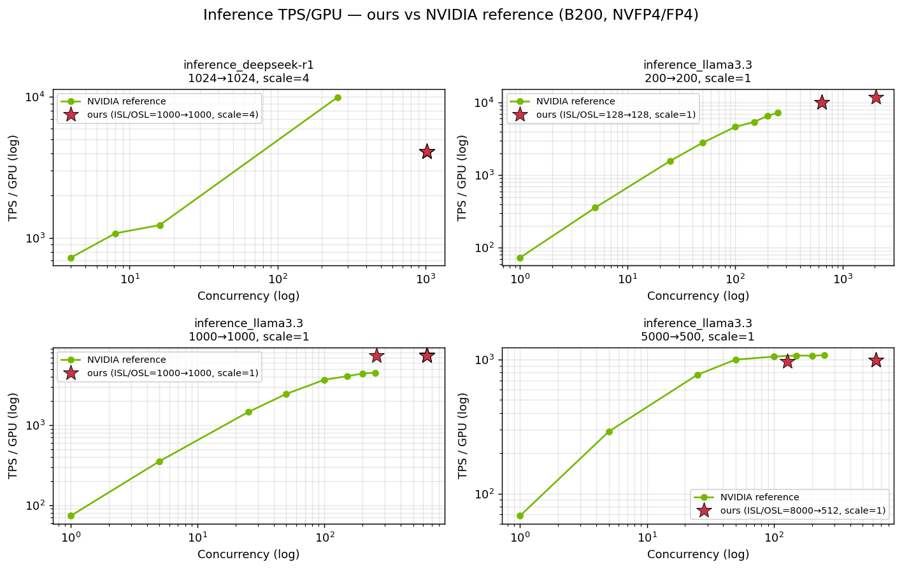

# B200 / Vultr POC — cluster test summary
Generated: 2026-05-18T23:43:43Z

Consolidated test summary for the AMP / Vultr HGX B200 cluster POC. Phase 0 covers hardware/fabric acceptance (NCCL collectives, IB perftest); Phase 1 covers the dgxc-benchmarking performance suite (training, finetune, inference).

**Files in this report folder:**

- `summary.md` / `summary.html` — this document
- `inference_vs_nvidia.png` — inline plot embedded in §6
- `sources/nccl_tests_dgxc.log` — raw NCCL bus-bandwidth sweep (referenced by §1 and §10)
- `sources/pairwise_ib_336.log` — raw `perftest` `ib_write_bw` / `ib_write_lat` output (referenced by §2)
- `sources/nvidia_reference_b200_training.md` — NVIDIA-published reference MFU for B200 training (referenced by §3 and §4)
- `sources/nvidia_reference_inference_llama3.3.csv` — NVIDIA reference inference points for `llama-3.3-70b-instruct:1.13.1` (referenced by §6)
- `sources/nvidia_reference_inference_dsv3.csv` — NVIDIA reference inference points for `deepseek-r1-TRTLLM-Serve:26-02` (referenced by §6)
- `sources/phase1_logs/<workload>/` — one representative run log per (workload, config) combination from Phase 1; large logs trimmed to the per-step section. Workloads included: `finetune_llama3`, `inference_deepseek-r1`, `inference_llama3.3`, `microbenchmark_system_info`, `pretrain_llama3.1`, `pretrain_nemotron4-15b`, `pretrain_qwen3`. Other Phase 1 workloads use stdout formats (SGLang server logs, Dynamo + AI Perf CSV) not surfaced in this report.

## Acceptance Tests (Phase 0)

Hardware/fabric validation independent of the NVIDIA benchmark suite. These confirm we're getting expected bandwidth/latency from NVLink, IB, and the storage path before trusting the Phase 1 performance numbers.

### 1. NCCL bus bandwidth

Per-collective busbw (source: [`sources/nccl_tests_dgxc.log`](sources/nccl_tests_dgxc.log)).
Sweep range: 8 B → 16 GiB. Peak is the maximum out-of-place busbw observed; 
Avg is NCCL's own `# Avg bus bandwidth` footer.

| Collective | Ranks | Scope | Peak busbw (GB/s) | At size | Avg busbw (GB/s) |
|---|---:|---|---:|---:|---:|
| all_reduce | 8 | intra-node | 842.91 | 16.00 GiB | 238.02 |
| all_gather | 8 | intra-node | 672.38 | 16.00 GiB | 207.96 |
| reduce_scatter | 8 | intra-node | 694.98 | 16.00 GiB | 207.88 |
| alltoall | 8 | intra-node | 672.67 | 16.00 GiB | 200.14 |
| alltoall_v2 | 8 | intra-node | 672.53 | 16.00 GiB | 200.23 |
| sendrecv | 8 | intra-node | 663.21 | 16.00 GiB | 153.06 |
| sendrecv_v2 | 8 | intra-node | 663.72 | 16.00 GiB | 153.12 |
| all_reduce | 16 | inter-node | 717.89 | 16.00 GiB | 191.96 |
| all_gather | 16 | inter-node | 308.03 | 16.00 GiB | 85.48 |
| reduce_scatter | 16 | inter-node | 307.91 | 8.00 GiB | 85.25 |
| alltoall | 16 | inter-node | 42.42 | 16.00 GiB | 17.41 |
| alltoall_v2 | 16 | inter-node | 69.37 | 16.00 GiB | 26.20 |
| sendrecv | 16 | inter-node | 19.82 | 512 MiB | 9.80 |
| sendrecv_v2 | 16 | inter-node | 35.85 | 4.00 GiB | 16.76 |

::: legend
**Legend:**
- **Collective** = NCCL op (`all_reduce`, `all_gather`, `reduce_scatter`, `alltoall`).
- **Ranks** = total GPUs in the test (8 = 1 node intra-node; 16 = 2 nodes inter-node).
- **Peak busbw** = max out-of-place busbw across the sweep, at the listed message size.
- **Avg busbw** = NCCL's per-run `# Avg bus bandwidth` footer (mean across the sweep).
:::

::: note
**Sanity envelope.** B200 NVLink5 intra-node `all_reduce`/`alltoall` ≳ 350 GB/s at large sizes; inter-node 2-node `all_reduce` on 8× NDR ≳ 60–80 GB/s; inter-node `alltoall` is scaling-limited, typically ~40–60 GB/s.

Full per-collective sweep tables are in §10 (Raw Output).
:::

### 2. IB pairwise bandwidth & latency (perftest)

Pure-IB pairwise measurement via `ib_write_bw` / `ib_write_lat` between gpu01↔gpu02, one HCA at a time (source: [`sources/pairwise_ib_336.log`](sources/pairwise_ib_336.log)).

| HCA | BW avg (GB/s) | BW avg (Gbps) | Latency p50 (μs) |
|---|---:|---:|---:|
| mlx5_0 | 45.07 | 369.2 | 2.68 |
| mlx5_1 | 45.07 | 369.2 | 2.68 |
| mlx5_2 | 45.07 | 369.2 | 2.68 |
| mlx5_3 | 45.07 | 369.2 | 2.68 |
| mlx5_4 | 39.54 | 323.9 | 2.81 |
| mlx5_9 | 40.01 | 327.8 | 2.81 |
| mlx5_12 | 40.04 | 328.0 | 2.84 |
| mlx5_13 | 39.71 | 325.3 | 2.84 |

::: legend
**Legend:**
- **BW avg (GB/s)** = `ib_write_bw` sustained throughput (binary GB/s — divide by 1024 of MiB/s).
- **BW avg (Gbps)** = wire-rate proxy (MiB/s × 8 / 1000) — compare against 400 Gbps NDR line rate.
- **Latency p50** = `ib_write_lat` average for 2-byte writes — proxy for inter-node small-message latency.
:::

::: note
**Sanity envelope.** ConnectX-7 NDR (400 Gbps line rate) sustains ~46–49 GB/s per HCA in `ib_write_bw`; p50 latency < 2 μs within the same rack.
:::

## Performance Summary (Phase 1)

Aggregated throughput, MFU, and inference-latency results from the dgxc-benchmarking suite (training, finetune, inference). Parsed via `collect_results.sh`; raw artifacts in `results/phase1/` and the archive at `results/phase1/archives/dgxc_archive_<date>.tar.zst`.

::: note
**A note on the NVIDIA reference comparison.** Where shown, the `NVIDIA ref` columns below compare our measurements against NVIDIA's published B200 numbers (<https://aibenchmarking.ngc.nvidia.com/>). These are *approximate* comparisons because NVIDIA doesn't publish every configuration we tested — sequence-length pairs, concurrency values, and library versions (e.g., TRT-LLM, NeMo, dgxc) often differ between our runs and the closest NVIDIA-published cell. The intent is to sanity-check **order-of-magnitude** and **relative scale** vs the reference, not to claim a strict apples-to-apples match. When the closest NVIDIA cell is materially different from our config (e.g., concurrency off by 2×+, or sequence length off by 50%+), the comparison should be read as directional.
:::

### 3. Training — summary per model

Each row aggregates all runs grouped by (workload, size, dtype, scale).

| Workload | Size | Dtype | Scale | n | Step mean (ms) | Step min (ms) | Step max (ms) | Within-run σ mean (ms) | σ across runs (ms) | TFLOPS mean | TFLOPS min | TFLOPS max | Peak TFLOPS | MFU% | NVIDIA ref MFU% | Δ vs ref |
|---|---|---|---:|---:|---:|---:|---:|---:|---:|---:|---:|---:|---:|---:|---:|---:|
| pretrain_llama3.1 | 8b | fp8 | 8 | 8 | 4377.9 | 4319.5 | 4465.8 | 20.9 | 53.0 | 1541 | 1511 | 1562 | 4500 | 34.3% | 34.5% | -0.3pp |
| pretrain_llama3.1 | 8b | nvfp4 | 8 | 6 | 3484.6 | 3449.7 | 3524.2 | 18.8 | 31.0 | 1936 | 1914 | 1956 | 9000 | 21.5% | — | — |
| pretrain_nemotron4-15b | 15b | bf16 | 16 | 3 | 1107.0 | 913.0 | 1206.0 | 4.7 | 137.2 | 1342 | 1212 | 1600 | 2250 | 59.7% | 50.2% | +9.5pp |
| pretrain_nemotron4-15b | 15b | fp8 | 16 | 3 | 787.3 | 787.0 | 788.0 | 3.7 | 0.5 | 1856 | 1855 | 1856 | 4500 | 41.2% | 35.4% | +5.8pp |
| pretrain_qwen3 | 30b | bf16 | 16 | 3 | 10058.5 | 10057.2 | 10059.3 | 4.6 | 0.9 | 600 | 600 | 600 | 2250 | 26.6% | — | — |

::: legend
**Legend:**
- **Step mean/min/max** = per-step training time across runs in this config.
- **Within-run σ mean** = mean of per-run step-time std-dev (variance inside one run).
- **σ across runs** = std-dev of the per-run mean step time (variance between runs).
- **TFLOPS** = effective TFLOPS/GPU reported by the dgxc parser.
- **Peak TFLOPS** = B200 dense peak for this dtype (bf16: 2250, fp8: 4500, nvfp4/mxfp4: 9000).
- **MFU%** = TFLOPS mean / Peak TFLOPS × 100.
- **NVIDIA ref MFU%** = NVIDIA-published B200 MFU for the same config; source: <https://aibenchmarking.ngc.nvidia.com/> (transcribed in [`sources/nvidia_reference_b200_training.md`](sources/nvidia_reference_b200_training.md)).
- **Δ vs ref** = our MFU minus NVIDIA's, in percentage points (positive = we exceed the ref).
:::

### 4. Finetune — summary per model

Each row aggregates all runs grouped by (workload, size, dtype, scale).

| Workload | Size | Dtype | Scale | n | Step mean (ms) | Step min (ms) | Step max (ms) | Within-run σ mean (ms) | σ across runs (ms) | TFLOPS mean | TFLOPS min | TFLOPS max | Peak TFLOPS | MFU% | NVIDIA ref MFU% | Δ vs ref |
|---|---|---|---:|---:|---:|---:|---:|---:|---:|---:|---:|---:|---:|---:|---:|---:|
| finetune_llama3 | 70b | bf16 | 16 | 3 | 4747.4 | 4728.6 | 4757.4 | 18.1 | 13.4 | 961 | 959 | 965 | 2250 | 42.7% | 23.2% | +19.5pp |
| finetune_llama3 | 70b | fp8 | 16 | 3 | 3073.1 | 3068.2 | 3081.5 | 13.7 | 6.0 | 1485 | 1481 | 1487 | 4500 | 33.0% | 17.3% | +15.7pp |

::: legend
**Legend:**
- **Step mean/min/max** = per-step training time across runs in this config.
- **Within-run σ mean** = mean of per-run step-time std-dev (variance inside one run).
- **σ across runs** = std-dev of the per-run mean step time (variance between runs).
- **TFLOPS** = effective TFLOPS/GPU reported by the dgxc parser.
- **Peak TFLOPS** = B200 dense peak for this dtype (bf16: 2250, fp8: 4500, nvfp4/mxfp4: 9000).
- **MFU%** = TFLOPS mean / Peak TFLOPS × 100.
- **NVIDIA ref MFU%** = NVIDIA-published B200 MFU for the same config; source: <https://aibenchmarking.ngc.nvidia.com/> (transcribed in [`sources/nvidia_reference_b200_training.md`](sources/nvidia_reference_b200_training.md)).
- **Δ vs ref** = our MFU minus NVIDIA's, in percentage points (positive = we exceed the ref).
:::

### 5. Inference — summary per model (across use cases)

Each row aggregates all parsed use cases of an inference workload.

| Workload | Engine | Size | Dtype | Scale | n use cases | TPS/GPU mean | TPS/GPU min | TPS/GPU max | TTFT mean (ms) | TTFT min | TTFT max | TPOT mean (ms) | TPOT min | TPOT max |
|---|---|---|---|---:|---:|---:|---:|---:|---:|---:|---:|---:|---:|---:|
| inference_deepseek-r1 | TRT-LLM | 671b | nvfp4 | 4 | 5 | 4100.4 | 4064.6 | 4118.3 | 1935.3 | 1934.2 | 1937.5 | 60.26 | 59.98 | 60.80 |
| inference_llama3.3 | TRT-LLM | 70b | nvfp4 | 1 | 17 | 6526.2 | 969.4 | 11888.8 | 60084.7 | 622.9 | 260651.4 | 72.38 | 34.00 | 138.80 |

::: legend
**Legend:**
- **Engine** = inference framework: `TRT-LLM` (TensorRT-LLM bench), `SGLang`, `Dynamo + TRT-LLM` (NVIDIA Dynamo serving with TRT-LLM backend).
- **TPS/GPU** = output tokens/sec per GPU (per-device throughput).
- **TTFT** = Time-to-First-Token, ms — latency from request submission to first streamed token.
- **TPOT** = Time-Per-Output-Token, ms — steady-state per-token latency after TTFT.
:::

::: note
**Why TTFT max ≫ TTFT mean for `inference_llama3.3`.** Look at the per-use-case breakdown in §9: the high values come specifically from the CON640 `summarization` and `reasoning` rows — TTFT up to ~260 s for summarization, ~29 s for reasoning. These are a **benchmark-configuration artifact, not a hardware limit**:

- dgxc's default at high concurrency (`CON640`) sets `max_num_tokens=2048`.
- `summarization` has 8000-token inputs; 640 concurrent requests must all wait through the prefill scheduler, which can only consume 2048 input tokens per step.
- Queues build up; TTFT inflates. **Per-token throughput (TPS/GPU, TPOT) is unaffected** — the model still serves the same tokens/sec; only first-token latency is hurt.
- The same `summarization` workload at `CON128` / `CON256` with `max_num_tokens=8192` (visible in the lower-concurrency `inference_llama3.3` rows of §9) achieves the same TPS/GPU at **15–24× lower TTFT**.

Takeaway: don't read 60s TTFT as a B200/cluster limitation. For first-token latency comparisons, use the CON128/256 rows in §9; for steady-state per-token latency use TPOT (which is consistent across all rows).
:::

### 6. Inference — comparison vs NVIDIA reference (closest match)

For each of our parsed inference runs with a matching NVIDIA-published reference, this table shows the closest published cell. Reference sources per workload:

- `inference_llama3.3` → `sources/nvidia_reference_inference_llama3.3.csv` (model `llama-3.3-70b-instruct:1.13.1`, NVFP4, B200).
- `inference_deepseek-r1` → `sources/nvidia_reference_inference_dsv3.csv` (model `deepseek-r1-TRTLLM-Serve:26-02`, FP4, B200).

Our TRT-LLM version is **1.1.0rc5**; the NVIDIA cells were measured with newer builds (see the 'NVIDIA ref' note at the top of Phase 1).

| Workload | Use case | Scale | Our ISL→OSL | Our CON | Our TPS/GPU | Our TTFT ms | Our TPOT ms | NVIDIA cell (ISL→OSL, scale, CON) | NVIDIA TPS/GPU | NVIDIA TTFT | NVIDIA TPOT | Match |
|---|---|---:|---|---:|---:|---:|---:|---|---:|---:|---:|:---:|
| inference_llama3.3 | reasoning | 1 | 1000→1000 | 256 | 7275 | 1199 | 34.0 | 1000→1000, s=1, CON=250 | 4512 | 12443 | 40.0 | ✓ |
| inference_deepseek-r1 | reasoning | 4 | 1000→1000 | 1024 | 4118 | 1934 | 60.0 | 1024→1024, s=4, CON=256 | 9985 | 767 | 23.6 | ⚠ |
| inference_llama3.3 | chat | 1 | 128→128 | 640 | 10050 | 623 | 57.5 | 200→200, s=1, CON=250 | 7243 | 992 | 29.1 | ⚠ |
| inference_llama3.3 | chat | 1 | 128→128 | 2048 | 11889 | 3899 | 138.8 | 200→200, s=1, CON=250 | 7243 | 992 | 29.1 | ⚠ |
| inference_llama3.3 | reasoning | 1 | 1000→1000 | 640 | 7450 | 28682 | 54.0 | 1000→1000, s=1, CON=250 | 4512 | 12443 | 40.0 | ⚠ |
| inference_llama3.3 | summarization | 1 | 8000→512 | 128 | 969 | 17709 | 95.5 | 5000→500, s=1, CON=150 | 1073 | 34749 | 62.7 | ⚠ |
| inference_llama3.3 | summarization | 1 | 8000→512 | 640 | 991 | 260651 | 97.5 | 5000→500, s=1, CON=250 | 1078 | 76268 | 63.5 | ⚠ |

::: legend
**Match column legend:**
- **✓** = near-exact match (ISL/OSL within 10%, concurrency within 10%).
- **≈** = close (ISL/OSL within 50% and concurrency within 2×).
- **⚠** = loose (one or both axes off by more than that). Read as directional only.
:::

::: note
**Why our numbers often look better than NVIDIA's:** likely the **TRT-LLM version gap** (our 1.1.0rc5 vs NVIDIA's 1.13.1) and possible differences in scheduling defaults between dgxc's `trtllm-bench` and the Performance Explorer test rig. Comparison sanity-checks order-of-magnitude, not absolute deltas.
:::

**Plot** (one subplot per `(workload, ISL→OSL, scale)` cell that has both NVIDIA reference data and at least one of our runs; log-scale axes):



## Full Results (Phase 1)

One row per run, no aggregation. Provided for auditability; if you only need the headline numbers, the Performance Summary section above is sufficient.

### 7. Training — full results

One row per successful training run, no aggregation.

| Workload | Size | Dtype | Scale | Step mean (ms) | Step σ (ms) | TFLOPS/GPU | Peak TFLOPS |
|---|---|---|---:|---:|---:|---:|---:|
| pretrain_llama3.1 | 8b | fp8 | 8 | 4358.450 | 15.268 | 1547.89 | 4500 |
| pretrain_llama3.1 | 8b | fp8 | 8 | 4333.660 | 21.790 | 1556.77 | 4500 |
| pretrain_llama3.1 | 8b | fp8 | 8 | 4333.900 | 23.780 | 1556.67 | 4500 |
| pretrain_llama3.1 | 8b | fp8 | 8 | 4453.360 | 23.008 | 1514.92 | 4500 |
| pretrain_llama3.1 | 8b | fp8 | 8 | 4465.780 | 20.982 | 1510.69 | 4500 |
| pretrain_llama3.1 | 8b | fp8 | 8 | 4319.510 | 17.199 | 1561.86 | 4500 |
| pretrain_llama3.1 | 8b | fp8 | 8 | 4405.690 | 30.483 | 1531.33 | 4500 |
| pretrain_llama3.1 | 8b | fp8 | 8 | 4352.740 | 14.955 | 1549.93 | 4500 |
| pretrain_llama3.1 | 8b | nvfp4 | 8 | 3449.670 | 30.524 | 1955.80 | 9000 |
| pretrain_llama3.1 | 8b | nvfp4 | 8 | 3524.240 | 17.157 | 1914.29 | 9000 |
| pretrain_llama3.1 | 8b | nvfp4 | 8 | 3520.150 | 18.582 | 1916.55 | 9000 |
| pretrain_llama3.1 | 8b | nvfp4 | 8 | 3499.010 | 14.291 | 1928.10 | 9000 |
| pretrain_llama3.1 | 8b | nvfp4 | 8 | 3456.800 | 17.814 | 1951.65 | 9000 |
| pretrain_llama3.1 | 8b | nvfp4 | 8 | 3457.700 | 14.382 | 1951.14 | 9000 |
| pretrain_nemotron4-15b | 15b | bf16 | 16 | 1202.000 | 6.000 | 1215.50 | 2250 |
| pretrain_nemotron4-15b | 15b | bf16 | 16 | 913.000 | 1.000 | 1599.90 | 2250 |
| pretrain_nemotron4-15b | 15b | bf16 | 16 | 1206.000 | 7.000 | 1211.50 | 2250 |
| pretrain_nemotron4-15b | 15b | fp8 | 16 | 787.000 | 3.000 | 1856.40 | 4500 |
| pretrain_nemotron4-15b | 15b | fp8 | 16 | 787.000 | 4.000 | 1855.80 | 4500 |
| pretrain_nemotron4-15b | 15b | fp8 | 16 | 788.000 | 4.000 | 1855.00 | 4500 |
| pretrain_qwen3 | 30b | bf16 | 16 | 10057.200 | 4.130 | 599.67 | 2250 |
| pretrain_qwen3 | 30b | bf16 | 16 | 10058.940 | 4.613 | 599.56 | 2250 |
| pretrain_qwen3 | 30b | bf16 | 16 | 10059.280 | 5.181 | 599.55 | 2250 |

**Legend:**
- **Step mean** = mean per-step training time within this run.
- **Step σ** = std-dev of step time within this run.
- **TFLOPS/GPU** = effective TFLOPS per GPU.
- **Peak TFLOPS** = B200 dense peak for this dtype (bf16: 2250, fp8: 4500, nvfp4/mxfp4: 9000).

### 8. Finetune — full results

One row per successful finetune run, no aggregation.

| Workload | Size | Dtype | Scale | Step mean (ms) | Step σ (ms) | TFLOPS/GPU | Peak TFLOPS |
|---|---|---|---:|---:|---:|---:|---:|
| finetune_llama3 | 70b | bf16 | 16 | 4756.330 | 25.173 | 959.50 | 2250 |
| finetune_llama3 | 70b | bf16 | 16 | 4728.550 | 11.474 | 965.10 | 2250 |
| finetune_llama3 | 70b | bf16 | 16 | 4757.420 | 17.671 | 959.25 | 2250 |
| finetune_llama3 | 70b | fp8 | 16 | 3068.160 | 12.242 | 1487.41 | 4500 |
| finetune_llama3 | 70b | fp8 | 16 | 3081.480 | 15.223 | 1481.36 | 4500 |
| finetune_llama3 | 70b | fp8 | 16 | 3069.660 | 13.531 | 1486.04 | 4500 |

**Legend:**
- **Step mean** = mean per-step training time within this run.
- **Step σ** = std-dev of step time within this run.
- **TFLOPS/GPU** = effective TFLOPS per GPU.
- **Peak TFLOPS** = B200 dense peak for this dtype (bf16: 2250, fp8: 4500, nvfp4/mxfp4: 9000).

### 9. Inference — full results (every use case)

One row per parsed inference use case, no aggregation.

| Workload | Engine | Size | Dtype | Scale | Use case | In→Out tok | Req/s | Total output tok/s | TPS/GPU | TPS/User | Avg req latency (ms) | TTFT (ms) | TPOT (ms) |
|---|---|---|---|---:|---|---|---:|---:|---:|---:|---:|---:|---:|
| inference_deepseek-r1 | TRT-LLM | 671b | nvfp4 | 4 | reasoning | 1000→1000 | - | - | - | - | - | - | - |
| inference_deepseek-r1 | TRT-LLM | 671b | nvfp4 | 4 | reasoning | 1000→1000 | 16.47 | 16473.3 | 4118.3 | 16.27 | 61855.8 | 1934.2 | 59.98 |
| inference_deepseek-r1 | TRT-LLM | 671b | nvfp4 | 4 | reasoning | 1000→1000 | 16.26 | 16258.3 | 4064.6 | 16.05 | 62678.9 | 1937.5 | 60.80 |
| inference_deepseek-r1 | TRT-LLM | 671b | nvfp4 | 4 | reasoning | 1000→1000 | - | - | - | - | - | - | - |
| inference_deepseek-r1 | TRT-LLM | 671b | nvfp4 | 4 | reasoning | 1000→1000 | 16.47 | 16473.3 | 4118.3 | 16.27 | 61855.8 | 1934.2 | 59.98 |
| inference_llama3.3 | TRT-LLM | 70b | nvfp4 | 1 | chat | 128→128 | 92.88 | 11888.8 | 11888.8 | 6.24 | 21526.8 | 3898.7 | 138.80 |
| inference_llama3.3 | TRT-LLM | 70b | nvfp4 | 1 | chat | 128→128 | - | - | - | - | - | - | - |
| inference_llama3.3 | TRT-LLM | 70b | nvfp4 | 1 | chat | 128→128 | 78.52 | 10050.0 | 10050.0 | 16.86 | 7928.0 | 622.9 | 57.52 |
| inference_llama3.3 | TRT-LLM | 70b | nvfp4 | 1 | chat | 128→128 | - | - | - | - | - | - | - |
| inference_llama3.3 | TRT-LLM | 70b | nvfp4 | 1 | chat | 128→128 | 78.52 | 10050.0 | 10050.0 | 16.86 | 7928.0 | 622.9 | 57.52 |
| inference_llama3.3 | TRT-LLM | 70b | nvfp4 | 1 | generation | 512→8000 | - | - | - | - | - | - | - |
| inference_llama3.3 | TRT-LLM | 70b | nvfp4 | 1 | generation | 512→8000 | - | - | - | - | - | - | - |
| inference_llama3.3 | TRT-LLM | 70b | nvfp4 | 1 | generation | 512→8000 | - | - | - | - | - | - | - |
| inference_llama3.3 | TRT-LLM | 70b | nvfp4 | 1 | generation | 512→8000 | - | - | - | - | - | - | - |
| inference_llama3.3 | TRT-LLM | 70b | nvfp4 | 1 | reasoning | 1000→1000 | 7.28 | 7275.5 | 7275.5 | 28.51 | 35166.8 | 1199.1 | 34.00 |
| inference_llama3.3 | TRT-LLM | 70b | nvfp4 | 1 | reasoning | 1000→1000 | 7.45 | 7449.7 | 7449.7 | 12.67 | 82667.4 | 28682.5 | 54.04 |
| inference_llama3.3 | TRT-LLM | 70b | nvfp4 | 1 | reasoning | 1000→1000 | 7.34 | 7336.9 | 7336.9 | 12.48 | 83935.2 | 29105.9 | 54.88 |
| inference_llama3.3 | TRT-LLM | 70b | nvfp4 | 1 | reasoning | 1000→1000 | 7.45 | 7449.7 | 7449.7 | 12.67 | 82667.4 | 28682.5 | 54.04 |
| inference_llama3.3 | TRT-LLM | 70b | nvfp4 | 1 | reasoning | 1000→1000 | 7.34 | 7336.9 | 7336.9 | 12.48 | 83935.2 | 29105.9 | 54.88 |
| inference_llama3.3 | TRT-LLM | 70b | nvfp4 | 1 | summarization | 8000→512 | 1.89 | 969.4 | 969.4 | 7.97 | 66484.8 | 17708.7 | 95.45 |
| inference_llama3.3 | TRT-LLM | 70b | nvfp4 | 1 | summarization | 8000→512 | 1.94 | 990.7 | 990.7 | 1.83 | 310482.5 | 260651.4 | 97.52 |
| inference_llama3.3 | TRT-LLM | 70b | nvfp4 | 1 | summarization | 8000→512 | 1.94 | 990.7 | 990.7 | 1.83 | 310482.5 | 260651.4 | 97.52 |

::: legend
**Legend:**
- **Engine** = inference serving framework / kernel library:
  - **TRT-LLM** = TensorRT-LLM benchmark harness (`trtllm-bench`).
  - **SGLang** = SGLang server.
  - **Dynamo + TRT-LLM** = NVIDIA Dynamo serving framework, TRT-LLM as backend.
- **In→Out tok** = input → output sequence length per request (chat 128→128, reasoning 1000→1000, summarization 8000→512, generation 512→8000). Sourced from dgxc `dataset_<usecase>_<in>_<out>.txt`.
- **Req/s** = requests/sec served.
- **Total output tok/s** = aggregate output tokens/sec across all concurrent users.
- **TPS/GPU** = output tokens/sec per GPU (per-device throughput).
- **TPS/User** = output tokens/sec per concurrent user.
- **Avg req latency** = mean end-to-end request latency, ms.
- **TTFT** = Time-to-First-Token, ms.
- **TPOT** = Time-Per-Output-Token, ms (steady-state per-token latency).
:::

## Raw Output

Verbatim outputs from the test harnesses — handy for cross-checking the summary tables against the original files. Includes the NCCL collective sweeps (Phase 0) and the dgxc training-parser / TRT-LLM `PERFORMANCE OVERVIEW` blocks (Phase 1).

### 10. NCCL raw sweep (per collective)

Direct nccl-tests output for each (collective, scope) — full size × algbw × busbw sweep, in-place and out-of-place columns. Source: `nccl_tests_dgxc.log`.

**all_reduce  ranks=8  (intra-node)**

```
#       size         count      type   redop    root     time   algbw   busbw  #wrong     time   algbw   busbw  #wrong
#        (B)    (elements)                               (us)  (GB/s)  (GB/s)             (us)  (GB/s)  (GB/s)
           8             2     float     sum      -1    20.25    0.00    0.00       0    19.36    0.00    0.00       0
          16             4     float     sum      -1    18.89    0.00    0.00       0    19.29    0.00    0.00       0
          32             8     float     sum      -1    19.34    0.00    0.00       0    19.59    0.00    0.00       0
          64            16     float     sum      -1    22.61    0.00    0.00       0    22.65    0.00    0.00       0
         128            32     float     sum      -1    24.64    0.01    0.01       0    24.63    0.01    0.01       0
         256            64     float     sum      -1    24.73    0.01    0.02       0    24.80    0.01    0.02       0
         512           128     float     sum      -1    25.22    0.02    0.04       0    24.92    0.02    0.04       0
        1024           256     float     sum      -1    25.47    0.04    0.07       0    25.33    0.04    0.07       0
        2048           512     float     sum      -1    25.98    0.08    0.14       0    25.80    0.08    0.14       0
        4096          1024     float     sum      -1    26.37    0.16    0.27       0    25.88    0.16    0.28       0
        8192          2048     float     sum      -1    26.44    0.31    0.54       0    26.24    0.31    0.55       0
       16384          4096     float     sum      -1    26.69    0.61    1.07       0    26.53    0.62    1.08       0
       32768          8192     float     sum      -1    27.41    1.20    2.09       0    26.94    1.22    2.13       0
       65536         16384     float     sum      -1    28.39    2.31    4.04       0    27.82    2.36    4.12       0
      131072         32768     float     sum      -1    28.90    4.54    7.94       0    27.92    4.69    8.21       0
      262144         65536     float     sum      -1    29.22    8.97   15.70       0    28.93    9.06   15.86       0
      524288        131072     float     sum      -1    29.63   17.69   30.96       0    29.29   17.90   31.32       0
     1048576        262144     float     sum      -1    30.10   34.84   60.97       0    30.23   34.68   60.69       0
     2097152        524288     float     sum      -1    34.29   61.16  107.03       0    32.78   63.98  111.96       0
     4194304       1048576     float     sum      -1    56.17   74.67  130.67       0    57.27   73.23  128.16       0
     8388608       2097152     float     sum      -1    76.96  109.00  190.75       0    76.74  109.32  191.31       0
    16777216       4194304     float     sum      -1   106.99  156.81  274.42       0   105.53  158.99  278.23       0
    33554432       8388608     float     sum      -1   169.72  197.70  345.98       0   167.45  200.38  350.67       0
    67108864      16777216     float     sum      -1   277.18  242.12  423.70       0   277.70  241.66  422.91       0
   134217728      33554432     float     sum      -1   394.59  340.15  595.26       0   394.65  340.09  595.16       0
   268435456      67108864     float     sum      -1   712.60  376.70  659.23       0   711.14  377.47  660.57       0
   536870912     134217728     float     sum      -1  1334.60  402.27  703.98       0  1332.33  402.96  705.18       0
  1073741824     268435456     float     sum      -1  2601.84  412.69  722.20       0  2594.40  413.87  724.27       0
  2147483648     536870912     float     sum      -1  4605.28  466.31  816.04       0  4603.21  466.52  816.41       0
  4294967296    1073741824     float     sum      -1  9026.71  475.81  832.66       0  9019.02  476.21  833.37       0
  8589934592    2147483648     float     sum      -1  17919.9  479.35  838.86       0  17901.4  479.85  839.73       0
 17179869184    4294967296     float     sum      -1  35667.8  481.66  842.91       0  35653.4  481.86  843.25       0
# Out of bounds values : 0 OK
# Avg bus bandwidth    : 238.019
```

**all_gather  ranks=8  (intra-node)**

```
#       size         count      type   redop    root     time   algbw   busbw  #wrong     time   algbw   busbw  #wrong
#        (B)    (elements)                               (us)  (GB/s)  (GB/s)             (us)  (GB/s)  (GB/s)
           0             0     float    none      -1     0.17    0.00    0.00       0     0.13    0.00    0.00       0
           0             0     float    none      -1     0.13    0.00    0.00       0     0.14    0.00    0.00       0
           0             0     float    none      -1     0.13    0.00    0.00       0     0.16    0.00    0.00       0
           0             0     float    none      -1     0.22    0.00    0.00       0     0.16    0.00    0.00       0
         128             4     float    none      -1    16.12    0.01    0.01       0    15.86    0.01    0.01       0
         256             8     float    none      -1    16.05    0.02    0.01       0    16.16    0.02    0.01       0
         512            16     float    none      -1    16.21    0.03    0.03       0    16.05    0.03    0.03       0
        1024            32     float    none      -1    16.42    0.06    0.05       0    16.27    0.06    0.06       0
        2048            64     float    none      -1    16.74    0.12    0.11       0    16.38    0.12    0.11       0
        4096           128     float    none      -1    16.88    0.24    0.21       0    16.62    0.25    0.22       0
        8192           256     float    none      -1    17.13    0.48    0.42       0    16.56    0.49    0.43       0
       16384           512     float    none      -1    17.10    0.96    0.84       0    17.21    0.95    0.83       0
       32768          1024     float    none      -1    17.93    1.83    1.60       0    17.74    1.85    1.62       0
       65536          2048     float    none      -1    18.70    3.50    3.07       0    18.50    3.54    3.10       0
      131072          4096     float    none      -1    18.87    6.95    6.08       0    18.55    7.07    6.18       0
      262144          8192     float    none      -1    19.21   13.65   11.94       0    18.89   13.88   12.14       0
      524288         16384     float    none      -1    19.89   26.35   23.06       0    19.57   26.79   23.44       0
     1048576         32768     float    none      -1    19.69   53.24   46.59       0    20.17   51.99   45.49       0
     2097152         65536     float    none      -1    22.35   93.81   82.09       0    22.49   93.25   81.59       0
     4194304        131072     float    none      -1    29.96  139.98  122.48       0    28.68  146.25  127.97       0
     8388608        262144     float    none      -1    44.92  186.75  163.40       0    43.80  191.50  167.57       0
    16777216        524288     float    none      -1    49.04  342.15  299.38       0    48.34  347.05  303.67       0
    33554432       1048576     float    none      -1    76.98  435.87  381.39       0    75.19  446.24  390.46       0
    67108864       2097152     float    none      -1   139.13  482.36  422.06       0   138.72  483.77  423.30       0
   134217728       4194304     float    none      -1   207.50  646.84  565.98       0   206.38  650.33  569.04       0
   268435456       8388608     float    none      -1   393.96  681.38  596.21       0   390.72  687.04  601.16       0
   536870912      16777216     float    none      -1   762.42  704.16  616.14       0   759.79  706.61  618.28       0
  1073741824      33554432     float    none      -1  1486.06  722.54  632.22       0  1475.35  727.79  636.82       0
  2147483648      67108864     float    none      -1  2911.01  737.71  645.50       0  2873.51  747.34  653.92       0
  4294967296     134217728     float    none      -1  5723.35  750.43  656.62       0  5633.15  762.45  667.14       0
  8589934592     268435456     float    none      -1  11322.8  758.64  663.81       0  11102.2  773.71  677.00       0
 17179869184     536870912     float    none      -1  22357.0  768.43  672.38       0  21964.0  782.18  684.41       0
# Out of bounds values : 0 OK
# Avg bus bandwidth    : 207.963
```

**reduce_scatter  ranks=8  (intra-node)**

```
#       size         count      type   redop    root     time   algbw   busbw  #wrong     time   algbw   busbw  #wrong
#        (B)    (elements)                               (us)  (GB/s)  (GB/s)             (us)  (GB/s)  (GB/s)
           0             0     float     sum      -1     0.16    0.00    0.00       0     0.13    0.00    0.00       0
           0             0     float     sum      -1     0.13    0.00    0.00       0     0.13    0.00    0.00       0
           0             0     float     sum      -1     0.13    0.00    0.00       0     0.23    0.00    0.00       0
           0             0     float     sum      -1     0.25    0.00    0.00       0     0.17    0.00    0.00       0
         128             4     float     sum      -1    16.06    0.01    0.01       0    16.03    0.01    0.01       0
         256             8     float     sum      -1    16.01    0.02    0.01       0    16.16    0.02    0.01       0
         512            16     float     sum      -1    16.17    0.03    0.03       0    16.26    0.03    0.03       0
        1024            32     float     sum      -1    16.40    0.06    0.05       0    16.40    0.06    0.05       0
        2048            64     float     sum      -1    16.66    0.12    0.11       0    16.55    0.12    0.11       0
        4096           128     float     sum      -1    17.00    0.24    0.21       0    16.69    0.25    0.21       0
        8192           256     float     sum      -1    16.82    0.49    0.43       0    17.08    0.48    0.42       0
       16384           512     float     sum      -1    17.42    0.94    0.82       0    17.13    0.96    0.84       0
       32768          1024     float     sum      -1    17.67    1.85    1.62       0    17.65    1.86    1.62       0
       65536          2048     float     sum      -1    18.52    3.54    3.10       0    18.48    3.55    3.10       0
      131072          4096     float     sum      -1    18.50    7.09    6.20       0    18.59    7.05    6.17       0
      262144          8192     float     sum      -1    19.31   13.58   11.88       0    19.31   13.57   11.88       0
      524288         16384     float     sum      -1    20.06   26.13   22.87       0    19.65   26.68   23.35       0
     1048576         32768     float     sum      -1    19.70   53.23   46.57       0    19.13   54.82   47.97       0
     2097152         65536     float     sum      -1    23.90   87.76   76.79       0    22.95   91.37   79.95       0
     4194304        131072     float     sum      -1    34.26  122.44  107.13       0    35.06  119.63  104.68       0
     8388608        262144     float     sum      -1    58.36  143.75  125.78       0    58.52  143.35  125.43       0
    16777216        524288     float     sum      -1    52.30  320.78  280.68       0    51.31  326.98  286.11       0
    33554432       1048576     float     sum      -1    80.28  417.95  365.71       0    79.87  420.13  367.61       0
    67108864       2097152     float     sum      -1   138.64  484.06  423.55       0   141.08  475.68  416.22       0
   134217728       4194304     float     sum      -1   206.09  651.26  569.85       0   206.21  650.89  569.53       0
   268435456       8388608     float     sum      -1   388.79  690.45  604.14       0   387.24  693.21  606.56       0
   536870912      16777216     float     sum      -1   753.29  712.70  623.61       0   752.69  713.27  624.11       0
  1073741824      33554432     float     sum      -1  1451.69  739.65  647.19       0  1446.80  742.15  649.38       0
  2147483648      67108864     float     sum      -1  2808.62  764.60  669.03       0  2805.25  765.52  669.83       0
  4294967296     134217728     float     sum      -1  5552.57  773.51  676.82       0  5544.18  774.68  677.85       0
  8589934592     268435456     float     sum      -1  10912.1  787.19  688.79       0  10913.5  787.09  688.70       0
 17179869184     536870912     float     sum      -1  21629.9  794.27  694.98       0  21647.9  793.61  694.40       0
# Out of bounds values : 0 OK
# Avg bus bandwidth    : 207.877
```

**alltoall  ranks=8  (intra-node)**

```
#       size         count      type   redop    root     time   algbw   busbw  #wrong     time   algbw   busbw  #wrong
#        (B)    (elements)                               (us)  (GB/s)  (GB/s)             (us)  (GB/s)  (GB/s)
           0             0     uint8    none      -1     0.15    0.00    0.00       0     0.13    0.00    0.00    N/A
           0             0     uint8    none      -1     0.13    0.00    0.00       0     0.13    0.00    0.00    N/A
           0             0     uint8    none      -1     0.13    0.00    0.00       0     0.15    0.00    0.00    N/A
           0             0     uint8    none      -1     0.16    0.00    0.00       0     0.16    0.00    0.00    N/A
         128            16     uint8    none      -1    11.02    0.01    0.01       0    11.60    0.01    0.01    N/A
         256            32     uint8    none      -1    10.89    0.02    0.02       0    11.32    0.02    0.02    N/A
         512            64     uint8    none      -1    11.48    0.04    0.04       0    11.48    0.04    0.04    N/A
        1024           128     uint8    none      -1    11.11    0.09    0.08       0    11.14    0.09    0.08    N/A
        2048           256     uint8    none      -1    11.12    0.18    0.16       0    11.31    0.18    0.16    N/A
        4096           512     uint8    none      -1    11.25    0.36    0.32       0    12.75    0.32    0.28    N/A
        8192          1024     uint8    none      -1    11.37    0.72    0.63       0    11.53    0.71    0.62    N/A
       16384          2048     uint8    none      -1    11.97    1.37    1.20       0    11.53    1.42    1.24    N/A
       32768          4096     uint8    none      -1    11.81    2.78    2.43       0    11.99    2.73    2.39    N/A
       65536          8192     uint8    none      -1    12.44    5.27    4.61       0    12.53    5.23    4.57    N/A
      131072         16384     uint8    none      -1    12.92   10.14    8.88       0    13.47    9.73    8.52    N/A
      262144         32768     uint8    none      -1    13.68   19.17   16.77       0    12.96   20.23   17.70    N/A
      524288         65536     uint8    none      -1    14.53   36.08   31.57       0    14.19   36.96   32.34    N/A
     1048576        131072     uint8    none      -1    18.09   57.96   50.71       0    16.81   62.39   54.59    N/A
     2097152        262144     uint8    none      -1    23.52   89.15   78.01       0    22.99   91.22   79.82    N/A
     4194304        524288     uint8    none      -1    38.84  107.98   94.49       0    39.21  106.98   93.61    N/A
     8388608       1048576     uint8    none      -1    34.62  242.29  212.00       0    34.15  245.63  214.93    N/A
    16777216       2097152     uint8    none      -1    51.30  327.04  286.16       0    51.18  327.83  286.85    N/A
    33554432       4194304     uint8    none      -1    83.13  403.65  353.19       0    79.35  422.85  369.99    N/A
    67108864       8388608     uint8    none      -1   135.03  496.98  434.86       0   132.91  504.92  441.80    N/A
   134217728      16777216     uint8    none      -1   236.72  566.98  496.11       0   235.94  568.87  497.76    N/A
   268435456      33554432     uint8    none      -1   438.78  611.77  535.30       0   434.76  617.43  540.25    N/A
   536870912      67108864     uint8    none      -1   840.31  638.89  559.03       0   833.79  643.89  563.41    N/A
  1073741824     134217728     uint8    none      -1  1553.29  691.27  604.86       0  1563.26  686.86  601.00    N/A
  2147483648     268435456     uint8    none      -1  3040.54  706.28  618.00       0  3160.06  679.57  594.62    N/A
  4294967296     536870912     uint8    none      -1  5704.03  752.97  658.85       0  5656.33  759.32  664.41    N/A
  8589934592    1073741824     uint8    none      -1  11246.2  763.81  668.33       0  11188.2  767.77  671.80    N/A
 17179869184    2147483648     uint8    none      -1  22347.5  768.76  672.67       0  22211.3  773.48  676.79    N/A
# Out of bounds values : 0 OK
# Avg bus bandwidth    : 200.139
```

**alltoall_v2  ranks=8  (intra-node)**

```
#       size         count      type   redop    root     time   algbw   busbw  #wrong     time   algbw   busbw  #wrong
#        (B)    (elements)                               (us)  (GB/s)  (GB/s)             (us)  (GB/s)  (GB/s)
           0             0     uint8    none      -1     0.16    0.00    0.00       0     0.13    0.00    0.00    N/A
           0             0     uint8    none      -1     0.13    0.00    0.00       0     0.13    0.00    0.00    N/A
           0             0     uint8    none      -1     0.13    0.00    0.00       0     0.16    0.00    0.00    N/A
           0             0     uint8    none      -1     0.16    0.00    0.00       0     0.17    0.00    0.00    N/A
         128            16     uint8    none      -1    10.88    0.01    0.01       0    11.35    0.01    0.01    N/A
         256            32     uint8    none      -1    11.05    0.02    0.02       0    11.34    0.02    0.02    N/A
         512            64     uint8    none      -1    11.01    0.05    0.04       0    11.12    0.05    0.04    N/A
        1024           128     uint8    none      -1    11.12    0.09    0.08       0    11.24    0.09    0.08    N/A
        2048           256     uint8    none      -1    11.25    0.18    0.16       0    11.23    0.18    0.16    N/A
        4096           512     uint8    none      -1    11.62    0.35    0.31       0    11.43    0.36    0.31    N/A
        8192          1024     uint8    none      -1    11.25    0.73    0.64       0    11.34    0.72    0.63    N/A
       16384          2048     uint8    none      -1    11.42    1.43    1.26       0    11.32    1.45    1.27    N/A
       32768          4096     uint8    none      -1    11.72    2.80    2.45       0    11.98    2.74    2.39    N/A
       65536          8192     uint8    none      -1    12.63    5.19    4.54       0    12.64    5.18    4.54    N/A
      131072         16384     uint8    none      -1    13.26    9.89    8.65       0    13.02   10.07    8.81    N/A
      262144         32768     uint8    none      -1    13.58   19.31   16.90       0    12.77   20.53   17.97    N/A
      524288         65536     uint8    none      -1    14.44   36.31   31.77       0    13.91   37.69   32.98    N/A
     1048576        131072     uint8    none      -1    17.73   59.13   51.74       0    16.89   62.08   54.32    N/A
     2097152        262144     uint8    none      -1    23.48   89.32   78.16       0    24.11   86.98   76.10    N/A
     4194304        524288     uint8    none      -1    39.13  107.18   93.78       0    38.91  107.80   94.32    N/A
     8388608       1048576     uint8    none      -1    34.36  244.16  213.64       0    33.84  247.93  216.93    N/A
    16777216       2097152     uint8    none      -1    51.32  326.89  286.03       0    51.46  326.00  285.25    N/A
    33554432       4194304     uint8    none      -1    83.11  403.73  353.27       0    78.87  425.45  372.27    N/A
    67108864       8388608     uint8    none      -1   134.87  497.57  435.37       0   133.03  504.45  441.40    N/A
   134217728      16777216     uint8    none      -1   236.79  566.83  495.98       0   235.77  569.27  498.11    N/A
   268435456      33554432     uint8    none      -1   437.63  613.38  536.71       0   434.19  618.25  540.97    N/A
   536870912      67108864     uint8    none      -1   839.90  639.20  559.30       0   829.49  647.23  566.32    N/A
  1073741824     134217728     uint8    none      -1  1554.17  690.88  604.52       0  1564.01  686.53  600.72    N/A
  2147483648     268435456     uint8    none      -1  3041.59  706.04  617.79       0  3164.15  678.69  593.85    N/A
  4294967296     536870912     uint8    none      -1  5705.08  752.83  658.73       0  5662.31  758.52  663.70    N/A
  8589934592    1073741824     uint8    none      -1  11249.7  763.57  668.13       0  11179.7  768.35  672.31    N/A
 17179869184    2147483648     uint8    none      -1  22351.8  768.61  672.53       0  22227.2  772.92  676.31    N/A
# Out of bounds values : 0 OK
# Avg bus bandwidth    : 200.228
```

**sendrecv  ranks=8  (intra-node)**

```
#       size         count      type   redop    root     time   algbw   busbw  #wrong     time   algbw   busbw  #wrong
#        (B)    (elements)                               (us)  (GB/s)  (GB/s)             (us)  (GB/s)  (GB/s)
           8             8     uint8     sum      -1     9.82    0.00    0.00       0     9.32    0.00    0.00    N/A
          16            16     uint8     sum      -1     9.14    0.00    0.00       0     9.33    0.00    0.00    N/A
          32            32     uint8     sum      -1     9.30    0.00    0.00       0     9.19    0.00    0.00    N/A
          64            64     uint8     sum      -1     9.05    0.01    0.01       0     9.35    0.01    0.01    N/A
         128           128     uint8     sum      -1     9.35    0.01    0.01       0     9.20    0.01    0.01    N/A
         256           256     uint8     sum      -1     9.21    0.03    0.03       0     9.25    0.03    0.03    N/A
         512           512     uint8     sum      -1     9.40    0.05    0.05       0     9.33    0.05    0.05    N/A
        1024          1024     uint8     sum      -1     9.45    0.11    0.11       0     9.29    0.11    0.11    N/A
        2048          2048     uint8     sum      -1     9.56    0.21    0.21       0     9.45    0.22    0.22    N/A
        4096          4096     uint8     sum      -1     9.74    0.42    0.42       0    10.00    0.41    0.41    N/A
        8192          8192     uint8     sum      -1    10.78    0.76    0.76       0    10.62    0.77    0.77    N/A
       16384         16384     uint8     sum      -1    11.67    1.40    1.40       0    11.60    1.41    1.41    N/A
       32768         32768     uint8     sum      -1    11.76    2.79    2.79       0    11.60    2.82    2.82    N/A
       65536         65536     uint8     sum      -1    13.13    4.99    4.99       0    12.81    5.12    5.12    N/A
      131072        131072     uint8     sum      -1    15.93    8.23    8.23       0    15.32    8.56    8.56    N/A
      262144        262144     uint8     sum      -1    22.26   11.78   11.78       0    20.90   12.54   12.54    N/A
      524288        524288     uint8     sum      -1    35.14   14.92   14.92       0    32.10   16.33   16.33    N/A
     1048576       1048576     uint8     sum      -1    27.92   37.56   37.56       0    26.88   39.01   39.01    N/A
     2097152       2097152     uint8     sum      -1    40.30   52.04   52.04       0    40.25   52.10   52.10    N/A
     4194304       4194304     uint8     sum      -1    62.37   67.25   67.25       0    62.62   66.98   66.98    N/A
     8388608       8388608     uint8     sum      -1   118.04   71.07   71.07       0   114.96   72.97   72.97    N/A
    16777216      16777216     uint8     sum      -1   212.62   78.91   78.91       0   213.57   78.56   78.56    N/A
    33554432      33554432     uint8     sum      -1   405.69   82.71   82.71       0   405.91   82.67   82.67    N/A
    67108864      67108864     uint8     sum      -1   793.11   84.61   84.61       0   788.86   85.07   85.07    N/A
   134217728     134217728     uint8     sum      -1   798.16  168.16  168.16       0   796.21  168.57  168.57    N/A
   268435456     268435456     uint8     sum      -1   809.77  331.50  331.50       0   805.95  333.07  333.07    N/A
   536870912     536870912     uint8     sum      -1   859.04  624.97  624.97       0   857.09  626.39  626.39    N/A
  1073741824    1073741824     uint8     sum      -1  1668.54  643.52  643.52       0  1679.12  639.47  639.47    N/A
  2147483648    2147483648     uint8     sum      -1  3286.67  653.39  653.39       0  3333.03  644.30  644.30    N/A
  4294967296    4294967296     uint8     sum      -1  6522.45  658.49  658.49       0  6662.14  644.68  644.68    N/A
  8589934592    8589934592     uint8     sum      -1  12989.0  661.32  661.32       0  13323.0  644.74  644.74    N/A
 17179869184   17179869184     uint8     sum      -1  25904.2  663.21  663.21       0  26662.0  644.36  644.36    N/A
# Out of bounds values : 0 OK
# Avg bus bandwidth    : 153.059
```

**sendrecv_v2  ranks=8  (intra-node)**

```
#       size         count      type   redop    root     time   algbw   busbw  #wrong     time   algbw   busbw  #wrong
#        (B)    (elements)                               (us)  (GB/s)  (GB/s)             (us)  (GB/s)  (GB/s)
           8             8     uint8     sum      -1     9.51    0.00    0.00       0     9.33    0.00    0.00    N/A
          16            16     uint8     sum      -1     9.08    0.00    0.00       0     9.24    0.00    0.00    N/A
          32            32     uint8     sum      -1     9.36    0.00    0.00       0     9.24    0.00    0.00    N/A
          64            64     uint8     sum      -1     9.15    0.01    0.01       0     9.21    0.01    0.01    N/A
         128           128     uint8     sum      -1     9.32    0.01    0.01       0     9.26    0.01    0.01    N/A
         256           256     uint8     sum      -1     9.18    0.03    0.03       0     9.19    0.03    0.03    N/A
         512           512     uint8     sum      -1     9.41    0.05    0.05       0     9.33    0.05    0.05    N/A
        1024          1024     uint8     sum      -1     9.46    0.11    0.11       0     9.39    0.11    0.11    N/A
        2048          2048     uint8     sum      -1     9.59    0.21    0.21       0     9.40    0.22    0.22    N/A
        4096          4096     uint8     sum      -1    10.01    0.41    0.41       0     9.94    0.41    0.41    N/A
        8192          8192     uint8     sum      -1    10.83    0.76    0.76       0    10.66    0.77    0.77    N/A
       16384         16384     uint8     sum      -1    11.64    1.41    1.41       0    11.35    1.44    1.44    N/A
       32768         32768     uint8     sum      -1    11.62    2.82    2.82       0    11.47    2.86    2.86    N/A
       65536         65536     uint8     sum      -1    13.15    4.98    4.98       0    12.87    5.09    5.09    N/A
      131072        131072     uint8     sum      -1    16.07    8.16    8.16       0    15.11    8.67    8.67    N/A
      262144        262144     uint8     sum      -1    22.50   11.65   11.65       0    21.83   12.01   12.01    N/A
      524288        524288     uint8     sum      -1    35.09   14.94   14.94       0    32.08   16.34   16.34    N/A
     1048576       1048576     uint8     sum      -1    27.31   38.40   38.40       0    26.66   39.34   39.34    N/A
     2097152       2097152     uint8     sum      -1    41.05   51.09   51.09       0    38.90   53.92   53.92    N/A
     4194304       4194304     uint8     sum      -1    62.11   67.53   67.53       0    63.69   65.85   65.85    N/A
     8388608       8388608     uint8     sum      -1   116.06   72.28   72.28       0   117.95   71.12   71.12    N/A
    16777216      16777216     uint8     sum      -1   211.28   79.41   79.41       0   214.26   78.30   78.30    N/A
    33554432      33554432     uint8     sum      -1   405.68   82.71   82.71       0   404.52   82.95   82.95    N/A
    67108864      67108864     uint8     sum      -1   792.44   84.69   84.69       0   788.58   85.10   85.10    N/A
   134217728     134217728     uint8     sum      -1   799.03  167.98  167.98       0   795.31  168.76  168.76    N/A
   268435456     268435456     uint8     sum      -1   808.27  332.11  332.11       0   806.15  332.99  332.99    N/A
   536870912     536870912     uint8     sum      -1   856.49  626.83  626.83       0   855.62  627.47  627.47    N/A
  1073741824    1073741824     uint8     sum      -1  1666.97  644.13  644.13       0  1674.19  641.35  641.35    N/A
  2147483648    2147483648     uint8     sum      -1  3288.39  653.05  653.05       0  3349.48  641.14  641.14    N/A
  4294967296    4294967296     uint8     sum      -1  6515.48  659.19  659.19       0  6670.90  643.84  643.84    N/A
  8589934592    8589934592     uint8     sum      -1  12968.4  662.38  662.38       0  13358.9  643.01  643.01    N/A
 17179869184   17179869184     uint8     sum      -1  25884.1  663.72  663.72       0  26627.6  645.19  645.19    N/A
# Out of bounds values : 0 OK
# Avg bus bandwidth    : 153.116
```

**all_reduce  ranks=16  (inter-node)**

```
#       size         count      type   redop    root     time   algbw   busbw  #wrong     time   algbw   busbw  #wrong
#        (B)    (elements)                               (us)  (GB/s)  (GB/s)             (us)  (GB/s)  (GB/s)
           8             2     float     sum      -1    36.17    0.00    0.00       0    35.19    0.00    0.00       0
          16             4     float     sum      -1    34.68    0.00    0.00       0    34.74    0.00    0.00       0
          32             8     float     sum      -1    35.14    0.00    0.00       0    35.03    0.00    0.00       0
          64            16     float     sum      -1    35.52    0.00    0.00       0    35.51    0.00    0.00       0
         128            32     float     sum      -1    36.41    0.00    0.01       0    35.97    0.00    0.01       0
         256            64     float     sum      -1    36.69    0.01    0.01       0    36.51    0.01    0.01       0
         512           128     float     sum      -1    37.40    0.01    0.03       0    37.06    0.01    0.03       0
        1024           256     float     sum      -1    37.54    0.03    0.05       0    37.62    0.03    0.05       0
        2048           512     float     sum      -1    38.87    0.05    0.10       0    38.41    0.05    0.10       0
        4096          1024     float     sum      -1    39.96    0.10    0.19       0    39.34    0.10    0.20       0
        8192          2048     float     sum      -1    41.72    0.20    0.37       0    40.79    0.20    0.38       0
       16384          4096     float     sum      -1    42.31    0.39    0.73       0    41.45    0.40    0.74       0
       32768          8192     float     sum      -1    43.57    0.75    1.41       0    42.52    0.77    1.44       0
       65536         16384     float     sum      -1    44.27    1.48    2.78       0    43.10    1.52    2.85       0
      131072         32768     float     sum      -1    64.46    2.03    3.81       0    61.23    2.14    4.01       0
      262144         65536     float     sum      -1    65.66    3.99    7.49       0    65.58    4.00    7.50       0
      524288        131072     float     sum      -1    77.88    6.73   12.62       0    77.29    6.78   12.72       0
     1048576        262144     float     sum      -1    93.41   11.23   21.05       0    93.02   11.27   21.14       0
     2097152        524288     float     sum      -1   104.94   19.98   37.47       0   101.33   20.70   38.81       0
     4194304       1048576     float     sum      -1   111.68   37.56   70.42       0   111.68   37.56   70.42       0
     8388608       2097152     float     sum      -1   136.20   61.59  115.48       0   133.99   62.61  117.39       0
    16777216       4194304     float     sum      -1   190.47   88.08  165.16       0   188.98   88.78  166.46       0
    33554432       8388608     float     sum      -1   249.24  134.63  252.43       0   245.14  136.88  256.65       0
    67108864      16777216     float     sum      -1   346.14  193.88  363.53       0   343.17  195.56  366.67       0
   134217728      33554432     float     sum      -1   597.27  224.72  421.35       0   600.90  223.36  418.80       0
   268435456      67108864     float     sum      -1   927.12  289.54  542.88       0   936.72  286.57  537.32       0
   536870912     134217728     float     sum      -1  1619.97  331.41  621.39       0  1624.59  330.47  619.62       0
  1073741824     268435456     float     sum      -1  3016.62  355.94  667.39       0  3019.36  355.62  666.79       0
  2147483648     536870912     float     sum      -1  5805.86  369.88  693.53       0  5803.56  370.03  693.80       0
  4294967296    1073741824     float     sum      -1  11382.9  377.32  707.47       0  11383.9  377.29  707.41       0
  8589934592    2147483648     float     sum      -1  22540.8  381.08  714.53       0  22543.8  381.03  714.44       0
 17179869184    4294967296     float     sum      -1  44870.6  382.88  717.89       0  44872.3  382.86  717.87       0
# Out of bounds values : 0 OK
# Avg bus bandwidth    : 191.956
```

**all_gather  ranks=16  (inter-node)**

```
#       size         count      type   redop    root     time   algbw   busbw  #wrong     time   algbw   busbw  #wrong
#        (B)    (elements)                               (us)  (GB/s)  (GB/s)             (us)  (GB/s)  (GB/s)
           0             0     float    none      -1     0.16    0.00    0.00       0     0.14    0.00    0.00       0
           0             0     float    none      -1     0.14    0.00    0.00       0     0.13    0.00    0.00       0
           0             0     float    none      -1     0.13    0.00    0.00       0     0.14    0.00    0.00       0
           0             0     float    none      -1     0.14    0.00    0.00       0     0.14    0.00    0.00       0
           0             0     float    none      -1     0.14    0.00    0.00       0     0.13    0.00    0.00       0
         256             4     float    none      -1    34.05    0.01    0.01       0    34.39    0.01    0.01       0
         512             8     float    none      -1    33.86    0.02    0.01       0    34.18    0.01    0.01       0
        1024            16     float    none      -1    34.44    0.03    0.03       0    34.46    0.03    0.03       0
        2048            32     float    none      -1    34.36    0.06    0.06       0    35.00    0.06    0.05       0
        4096            64     float    none      -1    35.00    0.12    0.11       0    34.93    0.12    0.11       0
        8192           128     float    none      -1    35.93    0.23    0.21       0    35.54    0.23    0.22       0
       16384           256     float    none      -1    36.25    0.45    0.42       0    35.67    0.46    0.43       0
       32768           512     float    none      -1    37.08    0.88    0.83       0    38.06    0.86    0.81       0
       65536          1024     float    none      -1    39.75    1.65    1.55       0    39.52    1.66    1.55       0
      131072          2048     float    none      -1    42.31    3.10    2.90       0    41.79    3.14    2.94       0
      262144          4096     float    none      -1    75.85    3.46    3.24       0    74.28    3.53    3.31       0
      524288          8192     float    none      -1    75.86    6.91    6.48       0    76.20    6.88    6.45       0
     1048576         16384     float    none      -1    77.59   13.51   12.67       0    77.54   13.52   12.68       0
     2097152         32768     float    none      -1   128.43   16.33   15.31       0   128.68   16.30   15.28       0
     4194304         65536     float    none      -1   139.74   30.02   28.14       0   139.42   30.08   28.20       0
     8388608        131072     float    none      -1   149.62   56.07   52.56       0   149.72   56.03   52.53       0
    16777216        262144     float    none      -1   202.24   82.96   77.77       0   200.08   83.85   78.61       0
    33554432        524288     float    none      -1   247.08  135.80  127.31       0   244.29  137.36  128.77       0
    67108864       1048576     float    none      -1   491.04  136.67  128.12       0   489.60  137.07  128.50       0
   134217728       2097152     float    none      -1   622.04  215.77  202.28       0   619.92  216.51  202.98       0
   268435456       4194304     float    none      -1  1018.68  263.51  247.04       0  1012.45  265.13  248.56       0
   536870912       8388608     float    none      -1  1717.36  312.61  293.08       0  1693.24  317.07  297.25       0
  1073741824      16777216     float    none      -1  3360.46  319.52  299.55       0  3321.73  323.25  303.04       0
  2147483648      33554432     float    none      -1  6591.25  325.81  305.45       0  6575.66  326.58  306.17       0
  4294967296      67108864     float    none      -1  13098.1  327.91  307.41       0  13087.2  328.18  307.67       0
  8589934592     134217728     float    none      -1  26185.0  328.05  307.54       0  26131.9  328.71  308.17       0
 17179869184     268435456     float    none      -1  52287.3  328.57  308.03       0  52294.5  328.52  307.99       0
# Out of bounds values : 0 OK
# Avg bus bandwidth    : 85.4758
```

**reduce_scatter  ranks=16  (inter-node)**

```
#       size         count      type   redop    root     time   algbw   busbw  #wrong     time   algbw   busbw  #wrong
#        (B)    (elements)                               (us)  (GB/s)  (GB/s)             (us)  (GB/s)  (GB/s)
           0             0     float     sum      -1     0.16    0.00    0.00       0     0.13    0.00    0.00       0
           0             0     float     sum      -1     0.13    0.00    0.00       0     0.13    0.00    0.00       0
           0             0     float     sum      -1     0.13    0.00    0.00       0     0.15    0.00    0.00       0
           0             0     float     sum      -1     0.15    0.00    0.00       0     0.13    0.00    0.00       0
           0             0     float     sum      -1     0.14    0.00    0.00       0     0.14    0.00    0.00       0
         256             4     float     sum      -1    33.45    0.01    0.01       0    33.79    0.01    0.01       0
         512             8     float     sum      -1    34.03    0.02    0.01       0    34.11    0.02    0.01       0
        1024            16     float     sum      -1    34.78    0.03    0.03       0    34.79    0.03    0.03       0
        2048            32     float     sum      -1    35.53    0.06    0.05       0    34.97    0.06    0.05       0
        4096            64     float     sum      -1    35.96    0.11    0.11       0    35.43    0.12    0.11       0
        8192           128     float     sum      -1    36.06    0.23    0.21       0    35.88    0.23    0.21       0
       16384           256     float     sum      -1    36.49    0.45    0.42       0    36.46    0.45    0.42       0
       32768           512     float     sum      -1    37.90    0.86    0.81       0    37.78    0.87    0.81       0
       65536          1024     float     sum      -1    39.77    1.65    1.54       0    39.49    1.66    1.56       0
      131072          2048     float     sum      -1    42.08    3.11    2.92       0    42.12    3.11    2.92       0
      262144          4096     float     sum      -1    79.74    3.29    3.08       0    78.74    3.33    3.12       0
      524288          8192     float     sum      -1    80.88    6.48    6.08       0    80.76    6.49    6.09       0
     1048576         16384     float     sum      -1    82.63   12.69   11.90       0    82.84   12.66   11.87       0
     2097152         32768     float     sum      -1   129.60   16.18   15.17       0   129.45   16.20   15.19       0
     4194304         65536     float     sum      -1   140.51   29.85   27.99       0   140.56   29.84   27.97       0
     8388608        131072     float     sum      -1   151.06   55.53   52.06       0   151.27   55.45   51.99       0
    16777216        262144     float     sum      -1   202.84   82.71   77.54       0   202.30   82.93   77.75       0
    33554432        524288     float     sum      -1   247.72  135.45  126.99       0   246.92  135.89  127.40       0
    67108864       1048576     float     sum      -1   490.40  136.85  128.29       0   487.91  137.54  128.95       0
   134217728       2097152     float     sum      -1   618.72  216.93  203.37       0   619.36  216.71  203.16       0
   268435456       4194304     float     sum      -1  1013.12  264.96  248.40       0  1014.39  264.63  248.09       0
   536870912       8388608     float     sum      -1  1705.43  314.80  295.13       0  1703.16  315.22  295.52       0
  1073741824      16777216     float     sum      -1  3340.30  321.45  301.36       0  3329.39  322.50  302.35       0
  2147483648      33554432     float     sum      -1  6585.55  326.09  305.71       0  6586.72  326.03  305.66       0
  4294967296      67108864     float     sum      -1  13200.8  325.36  305.02       0  13094.5  328.00  307.50       0
  8589934592     134217728     float     sum      -1  26154.2  328.43  307.91       0  26239.1  327.37  306.91       0
 17179869184     268435456     float     sum      -1  52956.4  324.42  304.14       0  52932.8  324.56  304.27       0
# Out of bounds values : 0 OK
# Avg bus bandwidth    : 85.2525
```

**alltoall  ranks=16  (inter-node)**

```
#       size         count      type   redop    root     time   algbw   busbw  #wrong     time   algbw   busbw  #wrong
#        (B)    (elements)                               (us)  (GB/s)  (GB/s)             (us)  (GB/s)  (GB/s)
           0             0     uint8    none      -1     0.21    0.00    0.00       0     0.14    0.00    0.00    N/A
           0             0     uint8    none      -1     0.16    0.00    0.00       0     0.14    0.00    0.00    N/A
           0             0     uint8    none      -1     0.14    0.00    0.00       0     0.15    0.00    0.00    N/A
           0             0     uint8    none      -1     0.14    0.00    0.00       0     0.14    0.00    0.00    N/A
           0             0     uint8    none      -1     0.14    0.00    0.00       0     0.21    0.00    0.00    N/A
         256            16     uint8    none      -1    40.53    0.01    0.01       0    37.05    0.01    0.01    N/A
         512            32     uint8    none      -1    37.45    0.01    0.01       0    37.18    0.01    0.01    N/A
        1024            64     uint8    none      -1    37.60    0.03    0.03       0    37.42    0.03    0.03    N/A
        2048           128     uint8    none      -1    37.68    0.05    0.05       0    37.40    0.05    0.05    N/A
        4096           256     uint8    none      -1    37.77    0.11    0.10       0    38.03    0.11    0.10    N/A
        8192           512     uint8    none      -1    37.27    0.22    0.21       0    39.84    0.21    0.19    N/A
       16384          1024     uint8    none      -1    37.86    0.43    0.41       0    38.16    0.43    0.40    N/A
       32768          2048     uint8    none      -1    40.42    0.81    0.76       0    40.15    0.82    0.77    N/A
       65536          4096     uint8    none      -1    39.63    1.65    1.55       0    40.36    1.62    1.52    N/A
      131072          8192     uint8    none      -1    43.00    3.05    2.86       0    42.35    3.09    2.90    N/A
      262144         16384     uint8    none      -1    49.31    5.32    4.98       0    47.32    5.54    5.19    N/A
      524288         32768     uint8    none      -1    57.19    9.17    8.59       0    56.58    9.27    8.69    N/A
     1048576         65536     uint8    none      -1    78.39   13.38   12.54       0    76.93   13.63   12.78    N/A
     2097152        131072     uint8    none      -1   101.12   20.74   19.44       0   100.72   20.82   19.52    N/A
     4194304        262144     uint8    none      -1   158.09   26.53   24.87       0   157.72   26.59   24.93    N/A
     8388608        524288     uint8    none      -1   267.63   31.34   29.39       0   269.05   31.18   29.23    N/A
    16777216       1048576     uint8    none      -1   445.46   37.66   35.31       0   442.73   37.90   35.53    N/A
    33554432       2097152     uint8    none      -1   819.17   40.96   38.40       0   817.16   41.06   38.50    N/A
    67108864       4194304     uint8    none      -1  1566.67   42.84   40.16       0  1568.94   42.77   40.10    N/A
   134217728       8388608     uint8    none      -1  3050.41   44.00   41.25       0  3063.73   43.81   41.07    N/A
   268435456      16777216     uint8    none      -1  6021.89   44.58   41.79       0  6032.37   44.50   41.72    N/A
   536870912      33554432     uint8    none      -1  11939.8   44.96   42.15       0  11978.3   44.82   42.02    N/A
  1073741824      67108864     uint8    none      -1  23807.2   45.10   42.28       0  23807.6   45.10   42.28    N/A
  2147483648     134217728     uint8    none      -1  47509.6   45.20   42.38       0  47462.2   45.25   42.42    N/A
  4294967296     268435456     uint8    none      -1  95002.7   45.21   42.38       0  94737.5   45.34   42.50    N/A
  8589934592     536870912     uint8    none      -1   189886   45.24   42.41       0   189281   45.38   42.55    N/A
 17179869184    1073741824     uint8    none      -1   379707   45.25   42.42       0   378306   45.41   42.57    N/A
# Out of bounds values : 0 OK
# Avg bus bandwidth    : 17.411
```

**alltoall_v2  ranks=16  (inter-node)**

```
#       size         count      type   redop    root     time   algbw   busbw  #wrong     time   algbw   busbw  #wrong
#        (B)    (elements)                               (us)  (GB/s)  (GB/s)             (us)  (GB/s)  (GB/s)
           0             0     uint8    none      -1     0.20    0.00    0.00       0     0.16    0.00    0.00    N/A
           0             0     uint8    none      -1     0.15    0.00    0.00       0     0.14    0.00    0.00    N/A
           0             0     uint8    none      -1     0.13    0.00    0.00       0     0.14    0.00    0.00    N/A
           0             0     uint8    none      -1     0.14    0.00    0.00       0     0.14    0.00    0.00    N/A
           0             0     uint8    none      -1     0.14    0.00    0.00       0     0.14    0.00    0.00    N/A
         256            16     uint8    none      -1    37.46    0.01    0.01       0    37.05    0.01    0.01    N/A
         512            32     uint8    none      -1    37.11    0.01    0.01       0    36.95    0.01    0.01    N/A
        1024            64     uint8    none      -1    37.61    0.03    0.03       0    36.38    0.03    0.03    N/A
        2048           128     uint8    none      -1    37.03    0.06    0.05       0    37.06    0.06    0.05    N/A
        4096           256     uint8    none      -1    37.19    0.11    0.10       0    37.27    0.11    0.10    N/A
        8192           512     uint8    none      -1    38.39    0.21    0.20       0    36.96    0.22    0.21    N/A
       16384          1024     uint8    none      -1    38.01    0.43    0.40       0    37.36    0.44    0.41    N/A
       32768          2048     uint8    none      -1    39.44    0.83    0.78       0    40.17    0.82    0.76    N/A
       65536          4096     uint8    none      -1    39.15    1.67    1.57       0    40.34    1.62    1.52    N/A
      131072          8192     uint8    none      -1    42.80    3.06    2.87       0    42.85    3.06    2.87    N/A
      262144         16384     uint8    none      -1    48.72    5.38    5.04       0    47.77    5.49    5.15    N/A
      524288         32768     uint8    none      -1    67.72    7.74    7.26       0    59.65    8.79    8.24    N/A
     1048576         65536     uint8    none      -1    78.33   13.39   12.55       0    77.14   13.59   12.74    N/A
     2097152        131072     uint8    none      -1   100.46   20.88   19.57       0   101.09   20.74   19.45    N/A
     4194304        262144     uint8    none      -1   130.50   32.14   30.13       0   126.07   33.27   31.19    N/A
     8388608        524288     uint8    none      -1   195.22   42.97   40.28       0   196.61   42.67   40.00    N/A
    16777216       1048576     uint8    none      -1   307.53   54.55   51.15       0   305.59   54.90   51.47    N/A
    33554432       2097152     uint8    none      -1   536.99   62.49   58.58       0   536.66   62.52   58.62    N/A
    67108864       4194304     uint8    none      -1   999.78   67.12   62.93       0  1001.40   67.01   62.83    N/A
   134217728       8388608     uint8    none      -1  1927.55   69.63   65.28       0  1934.37   69.39   65.05    N/A
   268435456      16777216     uint8    none      -1  3775.00   71.11   66.66       0  3766.50   71.27   66.81    N/A
   536870912      33554432     uint8    none      -1  7431.96   72.24   67.72       0  7439.85   72.16   67.65    N/A
  1073741824      67108864     uint8    none      -1  14720.0   72.94   68.39       0  14782.3   72.64   68.10    N/A
  2147483648     134217728     uint8    none      -1  29302.7   73.29   68.71       0  29386.2   73.08   68.51    N/A
  4294967296     268435456     uint8    none      -1  58467.6   73.46   68.87       0  58508.4   73.41   68.82    N/A
  8589934592     536870912     uint8    none      -1   116419   73.78   69.17       0   116420   73.78   69.17    N/A
 17179869184    1073741824     uint8    none      -1   232184   73.99   69.37       0   232773   73.81   69.19    N/A
# Out of bounds values : 0 OK
# Avg bus bandwidth    : 26.1976
```

**sendrecv  ranks=16  (inter-node)**

```
#       size         count      type   redop    root     time   algbw   busbw  #wrong     time   algbw   busbw  #wrong
#        (B)    (elements)                               (us)  (GB/s)  (GB/s)             (us)  (GB/s)  (GB/s)
           8             8     uint8     sum      -1    15.25    0.00    0.00       0    14.88    0.00    0.00    N/A
          16            16     uint8     sum      -1    14.55    0.00    0.00       0    14.52    0.00    0.00    N/A
          32            32     uint8     sum      -1    14.52    0.00    0.00       0    14.42    0.00    0.00    N/A
          64            64     uint8     sum      -1    14.39    0.00    0.00       0    14.48    0.00    0.00    N/A
         128           128     uint8     sum      -1    14.56    0.01    0.01       0    14.48    0.01    0.01    N/A
         256           256     uint8     sum      -1    14.43    0.02    0.02       0    14.62    0.02    0.02    N/A
         512           512     uint8     sum      -1    14.57    0.04    0.04       0    14.59    0.04    0.04    N/A
        1024          1024     uint8     sum      -1    15.25    0.07    0.07       0    14.52    0.07    0.07    N/A
        2048          2048     uint8     sum      -1    14.51    0.14    0.14       0    14.56    0.14    0.14    N/A
        4096          4096     uint8     sum      -1    14.55    0.28    0.28       0    14.50    0.28    0.28    N/A
        8192          8192     uint8     sum      -1    15.12    0.54    0.54       0    16.28    0.50    0.50    N/A
       16384         16384     uint8     sum      -1    19.85    0.83    0.83       0    19.25    0.85    0.85    N/A
       32768         32768     uint8     sum      -1    20.61    1.59    1.59       0    20.45    1.60    1.60    N/A
       65536         65536     uint8     sum      -1    29.81    2.20    2.20       0    29.81    2.20    2.20    N/A
      131072        131072     uint8     sum      -1    32.71    4.01    4.01       0    32.17    4.07    4.07    N/A
      262144        262144     uint8     sum      -1    35.68    7.35    7.35       0    35.88    7.31    7.31    N/A
      524288        524288     uint8     sum      -1    51.03   10.27   10.27       0    52.90    9.91    9.91    N/A
     1048576       1048576     uint8     sum      -1    68.03   15.41   15.41       0    68.06   15.41   15.41    N/A
     2097152       2097152     uint8     sum      -1   117.41   17.86   17.86       0   120.80   17.36   17.36    N/A
     4194304       4194304     uint8     sum      -1   221.66   18.92   18.92       0   227.32   18.45   18.45    N/A
     8388608       8388608     uint8     sum      -1   444.61   18.87   18.87       0   425.14   19.73   19.73    N/A
    16777216      16777216     uint8     sum      -1   853.00   19.67   19.67       0   895.42   18.74   18.74    N/A
    33554432      33554432     uint8     sum      -1  1733.72   19.35   19.35       0  1772.50   18.93   18.93    N/A
    67108864      67108864     uint8     sum      -1  3458.73   19.40   19.40       0  3448.15   19.46   19.46    N/A
   134217728     134217728     uint8     sum      -1  6925.35   19.38   19.38       0  6796.51   19.75   19.75    N/A
   268435456     268435456     uint8     sum      -1  13652.3   19.66   19.66       0  13513.1   19.86   19.86    N/A
   536870912     536870912     uint8     sum      -1  27086.8   19.82   19.82       0  27223.6   19.72   19.72    N/A
  1073741824    1073741824     uint8     sum      -1  54705.1   19.63   19.63       0  54130.3   19.84   19.84    N/A
  2147483648    2147483648     uint8     sum      -1   108529   19.79   19.79       0   109242   19.66   19.66    N/A
  4294967296    4294967296     uint8     sum      -1   218014   19.70   19.70       0   218786   19.63   19.63    N/A
  8589934592    8589934592     uint8     sum      -1   437674   19.63   19.63       0   437560   19.63   19.63    N/A
 17179869184   17179869184     uint8     sum      -1   875218   19.63   19.63       0   874531   19.64   19.64    N/A
# Out of bounds values : 0 OK
# Avg bus bandwidth    : 9.79516
```

**sendrecv_v2  ranks=16  (inter-node)**

```
#       size         count      type   redop    root     time   algbw   busbw  #wrong     time   algbw   busbw  #wrong
#        (B)    (elements)                               (us)  (GB/s)  (GB/s)             (us)  (GB/s)  (GB/s)
           8             8     uint8     sum      -1    15.08    0.00    0.00       0    14.88    0.00    0.00    N/A
          16            16     uint8     sum      -1    14.50    0.00    0.00       0    14.62    0.00    0.00    N/A
          32            32     uint8     sum      -1    14.66    0.00    0.00       0    14.54    0.00    0.00    N/A
          64            64     uint8     sum      -1    14.58    0.00    0.00       0    14.50    0.00    0.00    N/A
         128           128     uint8     sum      -1    14.62    0.01    0.01       0    14.53    0.01    0.01    N/A
         256           256     uint8     sum      -1    14.56    0.02    0.02       0    14.57    0.02    0.02    N/A
         512           512     uint8     sum      -1    14.68    0.03    0.03       0    14.45    0.04    0.04    N/A
        1024          1024     uint8     sum      -1    14.57    0.07    0.07       0    14.58    0.07    0.07    N/A
        2048          2048     uint8     sum      -1    14.69    0.14    0.14       0    14.59    0.14    0.14    N/A
        4096          4096     uint8     sum      -1    14.66    0.28    0.28       0    14.65    0.28    0.28    N/A
        8192          8192     uint8     sum      -1    15.17    0.54    0.54       0    14.78    0.55    0.55    N/A
       16384         16384     uint8     sum      -1    19.39    0.85    0.85       0    19.13    0.86    0.86    N/A
       32768         32768     uint8     sum      -1    20.70    1.58    1.58       0    20.27    1.62    1.62    N/A
       65536         65536     uint8     sum      -1    30.49    2.15    2.15       0    30.24    2.17    2.17    N/A
      131072        131072     uint8     sum      -1    32.78    4.00    4.00       0    32.20    4.07    4.07    N/A
      262144        262144     uint8     sum      -1    35.97    7.29    7.29       0    35.53    7.38    7.38    N/A
      524288        524288     uint8     sum      -1    50.71   10.34   10.34       0    37.78   13.88   13.88    N/A
     1048576       1048576     uint8     sum      -1    48.39   21.67   21.67       0    47.55   22.05   22.05    N/A
     2097152       2097152     uint8     sum      -1    75.87   27.64   27.64       0    75.60   27.74   27.74    N/A
     4194304       4194304     uint8     sum      -1   129.77   32.32   32.32       0   130.23   32.21   32.21    N/A
     8388608       8388608     uint8     sum      -1   249.84   33.58   33.58       0   250.01   33.55   33.55    N/A
    16777216      16777216     uint8     sum      -1   484.38   34.64   34.64       0   485.17   34.58   34.58    N/A
    33554432      33554432     uint8     sum      -1   946.98   35.43   35.43       0   955.92   35.10   35.10    N/A
    67108864      67108864     uint8     sum      -1  1892.57   35.46   35.46       0  1889.62   35.51   35.51    N/A
   134217728     134217728     uint8     sum      -1  3762.77   35.67   35.67       0  3755.86   35.74   35.74    N/A
   268435456     268435456     uint8     sum      -1  7498.88   35.80   35.80       0  7519.08   35.70   35.70    N/A
   536870912     536870912     uint8     sum      -1  14992.0   35.81   35.81       0  15015.0   35.76   35.76    N/A
  1073741824    1073741824     uint8     sum      -1  29980.6   35.81   35.81       0  29999.1   35.79   35.79    N/A
  2147483648    2147483648     uint8     sum      -1  59940.3   35.83   35.83       0  59970.3   35.81   35.81    N/A
  4294967296    4294967296     uint8     sum      -1   119811   35.85   35.85       0   119894   35.82   35.82    N/A
  8589934592    8589934592     uint8     sum      -1   239699   35.84   35.84       0   239719   35.83   35.83    N/A
 17179869184   17179869184     uint8     sum      -1   479242   35.85   35.85       0   479300   35.84   35.84    N/A
# Out of bounds values : 0 OK
# Avg bus bandwidth    : 16.7596
```

### 11. dgxc parser output (training + inference)

Verbatim output of the dgxc training parser (`parse_train_timing*.sh --format=table`)
and the inference performance blocks extracted from each workload's logs.

### finetune_llama3 (training parser)

```
Elapsed Time (ms) and MODEL_TFLOPS/GPU Analysis (iterations 35-44)
================================================================================
Experiment                                                                                   Status Time Mean (ms) Time Std (ms) MODEL_TFLOPS_per_GPU Mean MODEL_TFLOPS_per_GPU Std
------------------------------------------------------------------------------------------ -------- ------------- ------------ ------------------- ------------------
lora_llama3_70b_bf16_gpus16_tp1_pp2_cp1_vpNone_ep1_etpNone_mbs1_gbs64_234                   Success      4756.330       25.173              959.50               5.10
lora_llama3_70b_bf16_gpus16_tp1_pp2_cp1_vpNone_ep1_etpNone_mbs1_gbs64_235                   Success      4728.550       11.474              965.10               2.35
lora_llama3_70b_bf16_gpus16_tp1_pp2_cp1_vpNone_ep1_etpNone_mbs1_gbs64_236                   Success      4757.420       17.671              959.25               3.58
lora_llama3_70b_fp8_cs_gpus16_tp1_pp2_cp1_vpNone_ep1_etpNone_mbs1_gbs64_238                 Success      3068.160       12.242             1487.41               5.91
lora_llama3_70b_fp8_cs_gpus16_tp1_pp2_cp1_vpNone_ep1_etpNone_mbs1_gbs64_237                 Success      3081.480       15.223             1481.36               8.13
lora_llama3_70b_fp8_cs_gpus16_tp1_pp2_cp1_vpNone_ep1_etpNone_mbs1_gbs64_239                 Success      3069.660       13.531             1486.04               6.94

Summary:
  Success experiments: 6
```

### inference_deepseek-r1 (inference performance blocks)

```
==== inference_deepseek-r1 performance blocks ====
--- DeepSeek-R1_max_throughput_TP4_EP4_PP1_CON1024_reasoning_streaming-on_351.out ---
= PERFORMANCE OVERVIEW 
===========================================================
Request Throughput (req/sec):                     16.2583
Total Output Throughput (tokens/sec):             16258.3472
Total Token Throughput (tokens/sec):              32516.6944
Total Latency (ms):                               629830.3198
Average request latency (ms):                     62678.9133
Per User Output Throughput [w/ ctx] (tps/user):   16.0523
Per GPU Output Throughput (tps/gpu):              4064.5868
Average time-to-first-token [TTFT] (ms):          1937.5098
Average time-per-output-token [TPOT] (ms):        60.8022
Per User Output Speed (tps/user):                 16.5025

--- DeepSeek-R1_max_throughput_TP4_EP4_PP1_CON1024_reasoning_streaming-on_192.out ---
= PERFORMANCE OVERVIEW 
===========================================================
Request Throughput (req/sec):                     16.4733
Total Output Throughput (tokens/sec):             16473.3153
Total Token Throughput (tokens/sec):              32946.6306
Total Latency (ms):                               621611.3643
Average request latency (ms):                     61855.7559
Per User Output Throughput [w/ ctx] (tps/user):   16.2651
Per GPU Output Throughput (tps/gpu):              4118.3288
Average time-to-first-token [TTFT] (ms):          1934.1523
Average time-per-output-token [TPOT] (ms):        59.9816
Per User Output Speed (tps/user):                 16.7289
```

### inference_llama3.3 (inference performance blocks)

```
==== inference_llama3.3 performance blocks ====
--- Llama3.3-70B_TP1_EP1_PP1_CON640_summarization_streaming-on_190.out ---
= PERFORMANCE OVERVIEW 
===========================================================
Request Throughput (req/sec):                     1.9350
Total Output Throughput (tokens/sec):             990.7257
Total Token Throughput (tokens/sec):              16470.8143
Total Latency (ms):                               2116783.7517
Average request latency (ms):                     310482.5146
Per User Output Throughput [w/ ctx] (tps/user):   1.8314
Per GPU Output Throughput (tps/gpu):              990.7257
Average time-to-first-token [TTFT] (ms):          260651.4353
Average time-per-output-token [TPOT] (ms):        97.5168
Per User Output Speed (tps/user):                 10.3703

--- Llama3.3-70B_TP1_EP1_PP1_CON128_summarization_streaming-on_256.out ---
= PERFORMANCE OVERVIEW 
===========================================================
Request Throughput (req/sec):                     1.8934
Total Output Throughput (tokens/sec):             969.4386
Total Token Throughput (tokens/sec):              16116.9166
Total Latency (ms):                               540816.1020
Average request latency (ms):                     66484.8136
Per User Output Throughput [w/ ctx] (tps/user):   7.9741
Per GPU Output Throughput (tps/gpu):              969.4386
Average time-to-first-token [TTFT] (ms):          17708.6743
Average time-per-output-token [TPOT] (ms):        95.4523
Per User Output Speed (tps/user):                 10.9907

--- Llama3.3-70B_TP1_EP1_PP1_CON2048_chat_streaming-on_255.out ---
= PERFORMANCE OVERVIEW 
===========================================================
Request Throughput (req/sec):                     92.8814
Total Output Throughput (tokens/sec):             11888.8169
Total Token Throughput (tokens/sec):              23777.6338
Total Latency (ms):                               44099.2576
Average request latency (ms):                     21526.8182
Per User Output Throughput [w/ ctx] (tps/user):   6.2420
Per GPU Output Throughput (tps/gpu):              11888.8169
Average time-to-first-token [TTFT] (ms):          3898.6893
Average time-per-output-token [TPOT] (ms):        138.8042
Per User Output Speed (tps/user):                 7.4167

--- Llama3.3-70B_TP1_EP1_PP1_CON640_chat_streaming-on_190.out ---
= PERFORMANCE OVERVIEW 
===========================================================
Request Throughput (req/sec):                     78.5157
Total Output Throughput (tokens/sec):             10050.0123
Total Token Throughput (tokens/sec):              20100.0246
Total Latency (ms):                               52167.8963
Average request latency (ms):                     7928.0253
Per User Output Throughput [w/ ctx] (tps/user):   16.8550
Per GPU Output Throughput (tps/gpu):              10050.0123
Average time-to-first-token [TTFT] (ms):          622.8544
Average time-per-output-token [TPOT] (ms):        57.5210
Per User Output Speed (tps/user):                 18.2160

--- Llama3.3-70B_TP1_EP1_PP1_CON256_reasoning_streaming-on_254.out ---
= PERFORMANCE OVERVIEW 
===========================================================
Request Throughput (req/sec):                     7.2755
Total Output Throughput (tokens/sec):             7275.4519
Total Token Throughput (tokens/sec):              14550.9039
Total Latency (ms):                               562989.0812
Average request latency (ms):                     35166.8312
Per User Output Throughput [w/ ctx] (tps/user):   28.5071
Per GPU Output Throughput (tps/gpu):              7275.4519
Average time-to-first-token [TTFT] (ms):          1199.1013
Average time-per-output-token [TPOT] (ms):        34.0017
Per User Output Speed (tps/user):                 29.4557

--- Llama3.3-70B_TP1_EP1_PP1_CON640_reasoning_streaming-on_120.out ---
= PERFORMANCE OVERVIEW 
===========================================================
Request Throughput (req/sec):                     7.4497
Total Output Throughput (tokens/sec):             7449.6988
Total Token Throughput (tokens/sec):              14899.3976
Total Latency (ms):                               549820.8864
Average request latency (ms):                     82667.4085
Per User Output Throughput [w/ ctx] (tps/user):   12.6669
Per GPU Output Throughput (tps/gpu):              7449.6988
Average time-to-first-token [TTFT] (ms):          28682.4758
Average time-per-output-token [TPOT] (ms):        54.0390
Per User Output Speed (tps/user):                 18.6183

--- Llama3.3-70B_TP1_EP1_PP1_CON640_reasoning_streaming-on_190.out ---
= PERFORMANCE OVERVIEW 
===========================================================
Request Throughput (req/sec):                     7.3369
Total Output Throughput (tokens/sec):             7336.8555
Total Token Throughput (tokens/sec):              14673.7110
Total Latency (ms):                               558277.3170
Average request latency (ms):                     83935.2490
Per User Output Throughput [w/ ctx] (tps/user):   12.4776
Per GPU Output Throughput (tps/gpu):              7336.8555
Average time-to-first-token [TTFT] (ms):          29105.9471
Average time-per-output-token [TPOT] (ms):        54.8842
Per User Output Speed (tps/user):                 18.3308
```

### pretrain_llama3.1 (training parser)

```
Elapsed Time (ms) and MODEL_TFLOPS/GPU Analysis (iterations 35-44)
================================================================================
Experiment                                                                                   Status Time Mean (ms) Time Std (ms) MODEL_TFLOPS_per_GPU Mean MODEL_TFLOPS_per_GPU Std
------------------------------------------------------------------------------------------ -------- ------------- ------------ ------------------- ------------------
pretrain_llama3_8b_nvfp4_gpus8_tp1_pp1_cp1_vpNone_ep1_etpNone_mbs4_gbs128_104               Success      3449.670       30.524             1955.80              17.10
pretrain_llama3_8b_nvfp4_gpus8_tp1_pp1_cp1_vpNone_ep1_etpNone_mbs4_gbs128_103               Success      3524.240       17.157             1914.29               9.30
pretrain_llama3_8b_nvfp4_gpus8_tp1_pp1_cp1_vpNone_ep1_etpNone_mbs4_gbs128_188               Success      3520.150       18.582             1916.55              10.13
pretrain_llama3_8b_nvfp4_gpus8_tp1_pp1_cp1_vpNone_ep1_etpNone_mbs4_gbs128_187               Success      3499.010       14.291             1928.10               7.88
pretrain_llama3_8b_nvfp4_gpus8_tp1_pp1_cp1_vpNone_ep1_etpNone_mbs4_gbs128_102               Success      3456.800       17.814             1951.65              10.09
pretrain_llama3_8b_nvfp4_gpus8_tp1_pp1_cp1_vpNone_ep1_etpNone_mbs4_gbs128_189               Success      3457.700       14.382             1951.14               8.07
pretrain_llama3_8b_fp8_cs_gpus8_tp1_pp1_cp1_vpNone_ep1_etpNone_mbs2_gbs128_168              Success      4358.450       15.268             1547.89               5.43
pretrain_llama3_8b_fp8_cs_gpus8_tp1_pp1_cp1_vpNone_ep1_etpNone_mbs2_gbs128_184              Success      4333.660       21.790             1556.77               7.85
pretrain_llama3_8b_fp8_cs_gpus8_tp1_pp1_cp1_vpNone_ep1_etpNone_mbs2_gbs128_99               Success      4333.900       23.780             1556.67               8.55
pretrain_llama3_8b_fp8_cs_gpus8_tp1_pp1_cp1_vpNone_ep1_etpNone_mbs2_gbs128_185              Success      4453.360       23.008             1514.92               7.85
pretrain_llama3_8b_fp8_cs_gpus8_tp1_pp1_cp1_vpNone_ep1_etpNone_mbs2_gbs128_169              Success      4465.780       20.982             1510.69               7.10
pretrain_llama3_8b_fp8_cs_gpus8_tp1_pp1_cp1_vpNone_ep1_etpNone_mbs2_gbs128_186              Success      4319.510       17.199             1561.86               6.20
pretrain_llama3_8b_fp8_cs_gpus8_tp1_pp1_cp1_vpNone_ep1_etpNone_mbs2_gbs128_101              Success      4405.690       30.483             1531.33              10.62
pretrain_llama3_8b_fp8_cs_gpus8_tp1_pp1_cp1_vpNone_ep1_etpNone_mbs2_gbs128_100              Success      4352.740       14.955             1549.93               5.32

Summary:
  Success experiments: 14
```

### pretrain_nemotron4-15b (training parser)

```
Train Step Timing and TFLOPS Analysis (iterations 35-44)
================================================================================
Experiment                                                                                   Status Time Mean (s) Time Std (s) TFLOPS_per_GPU Mean TFLOPS_per_GPU Std
------------------------------------------------------------------------------------------ -------- ------------- ------------ ------------------- ------------------
pretrain_nemotron4_15b_fp8_gpus16_tp1_pp1_cp1_vp1_mbs2_gbs64_230                            Success         0.787        0.003             1856.40               6.28
pretrain_nemotron4_15b_fp8_gpus16_tp1_pp1_cp1_vp1_mbs2_gbs64_228                            Success         0.787        0.004             1855.80               8.82
pretrain_nemotron4_15b_fp8_gpus16_tp1_pp1_cp1_vp1_mbs2_gbs64_229                            Success         0.788        0.004             1855.00               9.04
pretrain_nemotron4_15b_bf16_gpus16_tp1_pp1_cp1_vp1_mbs2_gbs64_231                           Success         1.202        0.006             1215.50               5.99
pretrain_nemotron4_15b_bf16_gpus16_tp1_pp1_cp1_vp1_mbs2_gbs64_232                           Success         0.913        0.001             1599.90               1.14
pretrain_nemotron4_15b_bf16_gpus16_tp1_pp1_cp1_vp1_mbs2_gbs64_233                           Success         1.206        0.007             1211.50               7.35

Summary:
  Success experiments: 6
```

### pretrain_qwen3 (training parser)

```
Elapsed Time (ms) and MODEL_TFLOPS/GPU Analysis (iterations 35-44)
================================================================================
Experiment                                                                                   Status Time Mean (ms) Time Std (ms) MODEL_TFLOPS_per_GPU Mean MODEL_TFLOPS_per_GPU Std
------------------------------------------------------------------------------------------ -------- ------------- ------------ ------------------- ------------------
pretrain_qwen3_30b_a3b_bf16_gpus16_tp1_pp1_cp1_vpNone_ep8_etp1_mbs4_gbs1024_227             Success     10057.200        4.130              599.67               0.26
pretrain_qwen3_30b_a3b_bf16_gpus16_tp1_pp1_cp1_vpNone_ep8_etp1_mbs4_gbs1024_225             Success     10058.940        4.613              599.56               0.28
pretrain_qwen3_30b_a3b_bf16_gpus16_tp1_pp1_cp1_vpNone_ep8_etp1_mbs4_gbs1024_226             Success     10059.280        5.181              599.55               0.30

Summary:
  Success experiments: 3
```


